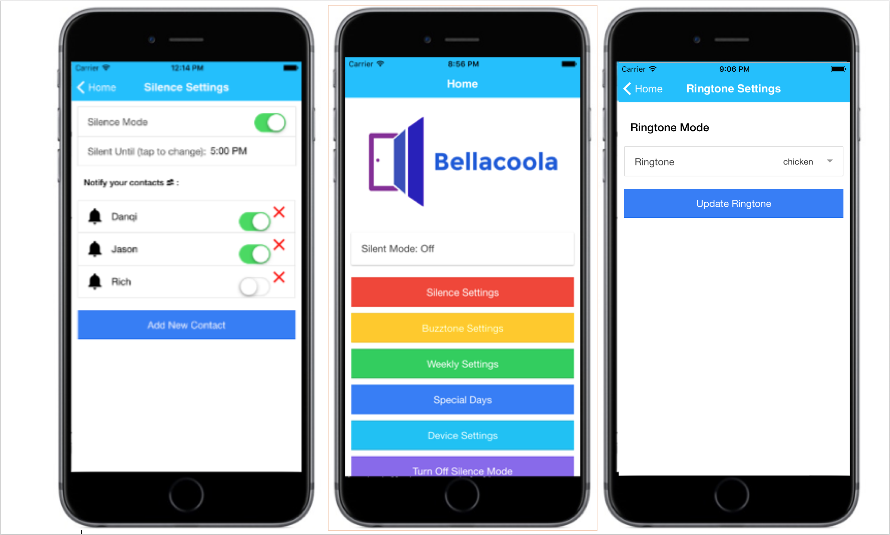

#### 

## Bellacoola - A 21st Century Doorbell

### Description

What you have on your door is a 20th century doorbell - outdated, stupid, and sub-par. Bellacoola brings your doorbell to the 21st century tech wizardry. 

Using a Raspberry Pi, Bellacoola can make your doorbell:

- Silence doorbell, and instead have notifications sent to users' phones
- Customize doorbell ring tone and playlist

### Codebase Structure
The repository is organized into three directories:
- server: Server code hosted on Heroku or locally, used as API endpoint to send text messages
- client: Mobile app for Android or iOS devices
- pi: Client on Rasperry Pi to emulate a doorbell


### Installing
To get the code run:

```bash
git clone https://github.com/eecs394-s16/Bellacoola
```

### Building and Deploying

All 3 components of the app must be deployed for it to work.

####Mobile Client: 
#####Deploy:
- Install Supersonic following instructions [here](http://www.appgyver.io/supersonic/)
- Install NodeJS 4 and NPM 2
- Run the following:

```bash
npm install steroids -g
# in the client directory:
npm install 
steroids connect
```

A browser tab should open with a QR code.

#####Install on mobile:
- Download the Appgyver Scanner app
- Scan the QR code 

####Server:

- To deploy to heroku from github, follow these [instructions](https://devcenter.heroku.com/articles/git)

#### Raspberry Pi
- Clone the code base
- Install the following:

```bash
pip install requests
pip install python-firebase
pip install pygame
```

- Edit the ENDPOINT variable in pi_client.py to point to your Heroku URL
- Run the following in the pi directory:

```bash
python pi_client.py
```

####Known Limitations
- System currently only works for a single doorbell
- No support for separate user accounts or access control
- Firebase URL is hard-coded and developer would need to replace references
- No in-app support for initializing user data in Firebase - entries for users and doorbells currently must be created manually in the database

## 
